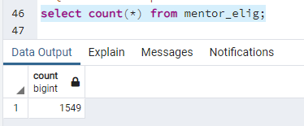
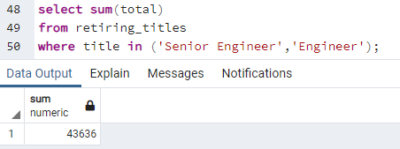
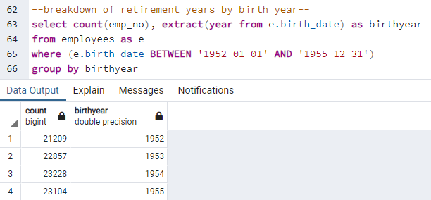

# Pewlett-Hackard-Analysis

# Overview of Analysis
Pewlett Hackard are a large company who are aware of an aging employee population which will be reaching retirement age soon. Ths analysis is to help to identify those who are eligible for retirement (based on company criteria) and prepare to future proof the company by identifying those eligible to participate in a mentorship program. The program would allow some eligible employees to step back to part time roles and mentor newly hired folks, rather than completely retiring. This analysis will form part of a presentation to CEO on the mentorship proposal. 

# Results
* 1549 employees eligible for mentor program

* Senior Engineer job title has the highest count of retiring employees (29414)

* Total of 43,636 Engineers are retirement eligible (Titles: Senior Engineer & Engineer)

* Many employees who are retiring have had multiple titles in their careers, indicating deep knowledge.

# Summary: 
1. How many roles will need to be filled as the "silver tsunami" begins to make an impact?
In total there will be 90,398 vacancies created by the upcoming 'silver tsunami'. This is almost 1/3 of the entire employee population (300,024). However, in the first year of the 'silver tsunami' (those born in 1952), we can see that 21,209 roles will need to be filled, with the next 3 years having 22,857 (1953), 23,228 (1954) and 23,104 (1955) respectively.

2. Are there enough qualified, retirement-ready employees in the departments to mentor the next generation of Pewlett Hackard employees?
There are a total of 1549 employees eligible for the mentorship program. This is a very small number in comparison to upcoming vacancies. The breakdown below shows us which departments eligible mentors are in:

Below shows the total number of current employees in the firm today:

